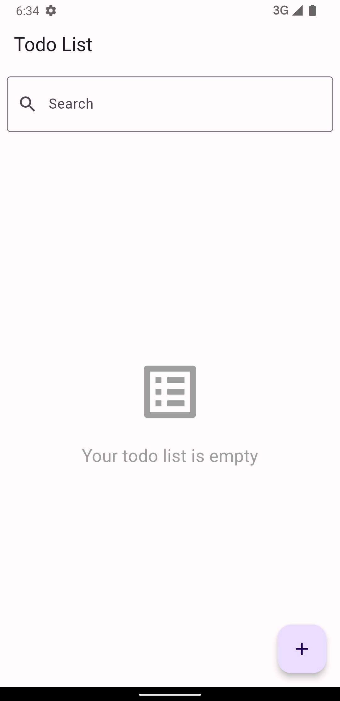
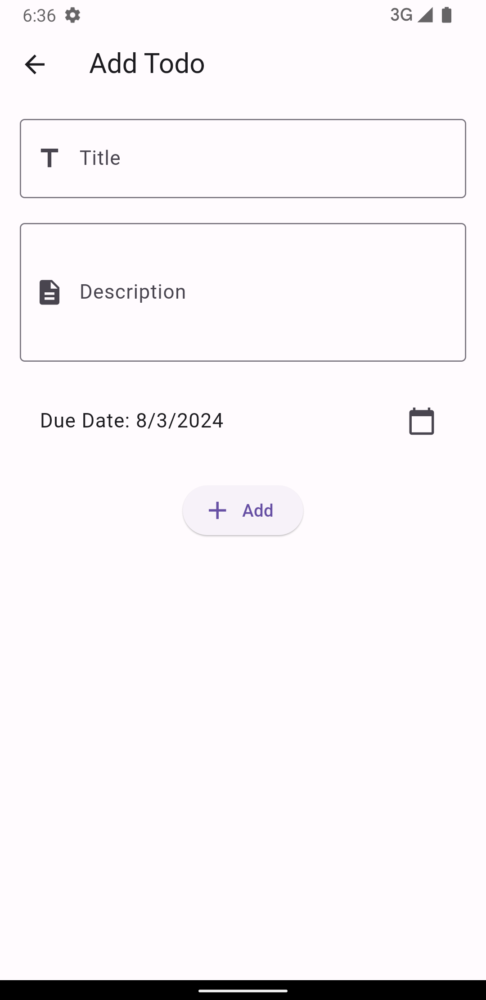
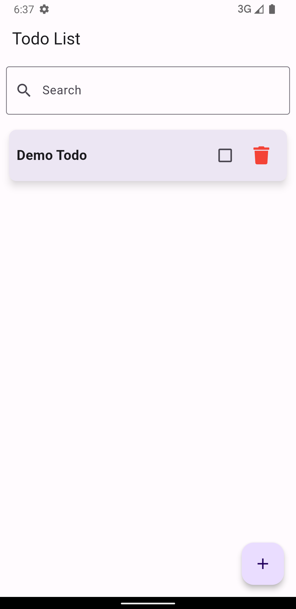

# Todo List App

A simple Todo List application built with Flutter 3.19.2 and `flutter_bloc` for state management.

## Features

- Create, read, update, and delete todo items
- Mark todo items as complete or incomplete
- Search functionality for todo items
- Data persistence with SQLite


## Screenshots

<p align="center">
  
  
  
</p>

## Download APK

You can download the APK file from the link below:

[Download Todo List App APK](https://drive.google.com/file/d/12vcXGBJDUisQ1XXwvoE8E9nBYuWiJ5Ea/view?usp=sharing)

## Setup Instructions

1. Clone the repository:
   ```sh
   git clone <repository-url>
   cd todo_list_app
   ```

2. Install dependencies:
   ```sh
   flutter pub get
   ```

3. Run the app:
   ```sh
   flutter run
   ```

## State Management

The app uses flutter_bloc for state management and follows the MVVM (Model-View-ViewModel) architecture. The BLoC pattern is used to handle the state of the todo items, including loading, adding, updating, and deleting todos.

## Assumptions

- The app assumes that the user will only have a single device.
- No authentication or user-specific data is implemented.

## Local Database

The app uses SQLite to store todo items. The data is persisted even when the app is closed and reopened.

## Libraries Used

- `flutter_bloc`: State management
- `sqflite`: Local database
- `path_provider`: To get the local database path
- `intl`: For internationalization
- `font_awesome_flutter`: For icons

## Directory Structure

```
TODO APP/
├── android/
├── build/
├── ios/
├── lib/
│   ├── data/
│   │   ├── database/
│   │   │   └── database_provider.dart
│   │   ├── models/
│   │   │   └── todo_model.dart
│   │   └── repositories/
│   │       └── todo_repository.dart
│   ├── viewmodels/
│   │   └── todo_viewmodel.dart
│   ├── views/
│   │   ├── add_todo_view.dart
│   │   ├── todo_details_view.dart
│   │   └── todo_list_view.dart
│   ├── widgets/
│   │   └── todo_item.dart
│   └── main.dart
├── pubspec.yaml
└── README.md

```

## Getting Started

1. Ensure you have Flutter 3.19.2 installed.
2. Follow the setup instructions above to clone the repository and install dependencies.
3. Run the app on your preferred device or simulator.

## Usage


- Add a todo by tapping the "+" button. 
- Tap the trash icon to delete a todo item.
- Tap the checkbox to mark a todo as complete or incomplete. 
- Tap on a todo item to view its details with a hero animation. 
- Use the search bar to filter todo items by title or description.

## Contributing

Feel free to submit issues and enhancement requests.

